# Episode 01-playlist: Let's build you a movie playlist.

**This flow loads a movie metadata CSV file and builds a playlist for your
favorite movie genre. Everything in Metaflow is versioned, so you can run it
multiple times and view all the historical playlists with the Metaflow client
in a Notebook.**

#### Showcasing:
- Including external files with 'IncludeFile'.
- Basic Metaflow Parameters.
- Running workflow branches in parallel and joining results.
- Using the Metaflow client in a Notebook.

#### Before playing this episode:
1. ```python -m pip install notebook```

#### To play this episode:
1. ```cd metaflow-tutorials```
2. ```python 01-playlist/playlist.py show```
3. ```python 01-playlist/playlist.py run```
4. ```python 01-playlist/playlist.py run --genre comedy```
5. ```jupyter-notebook 01-playlist/playlist.ipynb```

---
여기부터 내가 쓴거

## 실행 결과

헬로월드는 단순해서 show 결과에 큰 의미는 없어 보였는데, playlist에서의 show 결과는 다릅니다.

```bash
bash:~/workspace/metaflow$ python 01-playlist/playlist.py show
Metaflow 2.12.30 executing PlayListFlow for user:asanobm

좋아하는 영화 재생 목록을 만드는 데 도움을 주는 플로우입니다.

이 플로우는 다음 단계를 수행합니다:
1) 영화에 대한 메타데이터가 포함된 CSV 파일을 가져옵니다.
2) CSV에서 두 개의 열을 파이썬 리스트로 로드합니다.
3) 병렬 브랜치에서:
   - A) 장르 매개변수로 영화를 필터링합니다.
   - B) 다른 장르에서 무작위로 영화를 선택합니다.
4) 재생 목록의 상위 항목을 표시합니다.

Step start
    CSV 파일을 파싱하고 값을 리스트의 사전으로 로드합니다.
    => bonus_movie, genre_movies

Step bonus_movie
    이 단계에서는 다른 장르에서 무작위로 영화를 선택합니다.
    => join

Step genre_movies
    장르별로 영화를 필터링합니다.
    => join

Step join
    병렬 브랜치를 결합하고 결과를 병합합니다.
    => end

Step end
    재생 목록과 보너스 영화를 출력합니다.

```

show 결과를 보면, 어디서 어떤 작업을 수행하는지 알 수 있습니다. 물론, 전적으로 작성자가 작성을 해야지만 합니다.
그리고 다음 스텝이 무엇인지도 알 수 있습니다. 만약 이 플로우를 실행 했을 때, 어떤 스텝이 다음 스텝을 어디로 결정했는지 직관적으로 알 수 있습니다.
특히 병렬로 처리되는 부분은 =>bonus_movie, genre_movies, 이렇게 나옵니다. 그럼 각 스텝에서 다음 스텝을 join으로 결정했습니다.

```mermaid

flowchart TD
    start --> bonus_movie
    start --> genre_movies
    bonus_movie --> join
    genre_movies --> join
    join --> step_end[end]

```



**장르 필터링**

걍 필터링 하고 싶은 장르를 넣어주면 됩니다. 이렇게 하면 장르가 필터링 됩니다.

명령어는 run --genre comedy 이렇게 하면 코미디 장르만 나옵니다.

`PlayListFlow` 클래스는 다음 파라미터를 가지고 있습니다.
```python
genre = Parameter("genre", help="특정 장르의 영화를 필터링합니다.", default="Sci-Fi")
```
여기서 --genre [OPTION] 이렇게 하면 된다는 뜻인가 봅니다.

실제로 필터링은 genre_movies에서 이루어집니다. 이 부분을 보면 이해가 됩니다.

```python
    @step
    def genre_movies(self):
        from random import shuffle
        self.movies = [
            movie
            for movie, genres in zip(
                self.dataframe["movie_title"], self.dataframe["genres"]
            )
            if self.genre.lower() in genres.lower()
        ]
        shuffle(self.movies)
        self.next(self.join)
```
같은 방식으로 bonus_movie에서도 장르를 필터링 합니다.
결과적으로 장르 옵션을 선택하면 해당 장르만 필터링 되어 나옵니다.
그런데 없는 장르 옵션을 추가하면 보너스 영화만 나옵니다. 안타깝다!


```bash
python 01-playlist/playlist.py run --genre comedy 이렇게 하면 장르가 필터링 ...
```
오호 ~~

